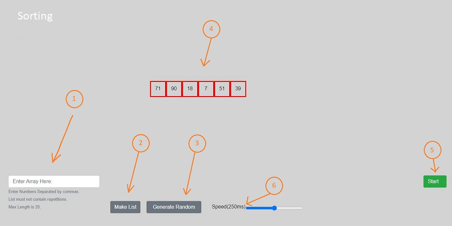
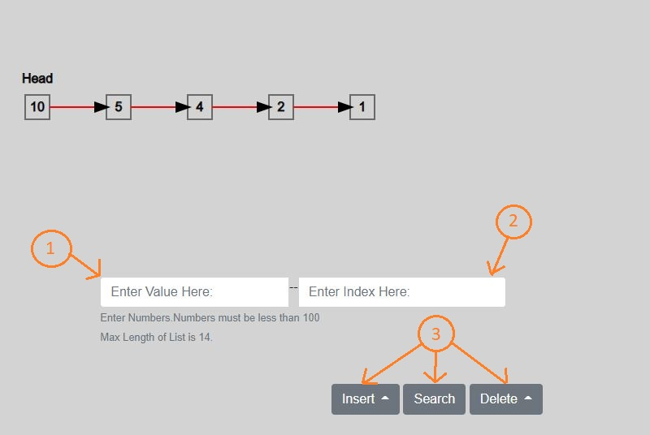
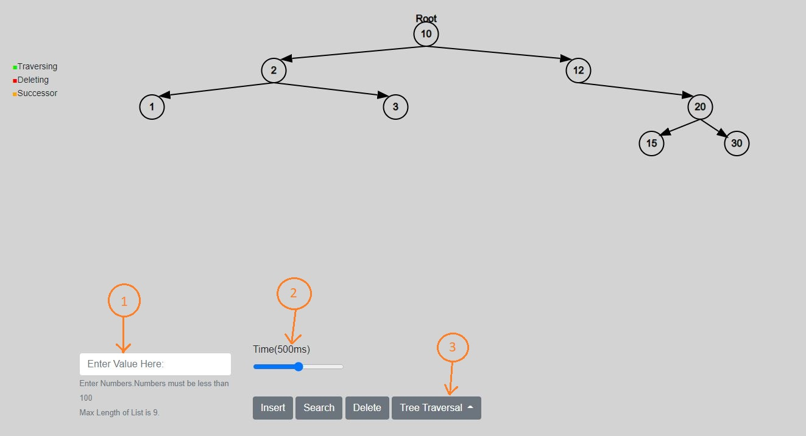

# Algorithm-Visualizer (Data Structures and Algorithms)

## Overview:
This Web App was made to help students learn and understand different Data Structures and the algorithms that can be applied to them.To be a programmer, these topics are an absolute requirement.

## Link:
You can find this on https://algorithm-visualizer12.herokuapp.com/

## Languages:
* Python(BackEnd)
* HTML
* CSS
* JS

## Configuration:
### Requirements:
To run the project you need to have following requirements
* You must have python(preferably latest version) and you must have follow libraries.
    1. asgiref
    2. Django
    3. django-crispy-forms
    4. gunicorn
    5. Pillow
    6. pytz
    7. sqlparse
    8. typing-extensions
    9. whitenoise 
    You can install them by using:
    ```pip install -r requirements.txt```
* And you must have latest browser with scripts allowed.   

### How to run it locally:
To run this on your machine. Firstly clone the repositories to your required folder. Make a python virtual enviroment preferably(You can still directly use python). Install the required libraries.Then run the file "manage.py" with the command "runserver". It will give a local address (127.0.0.1 or localhost). Just run that on your brower and you'll find it running.

### How to host it:
Just do most of the above task but for hosting. You have to add the domain in the settings.py in ALLOWED_HOST list.

## How to use it:

### Sorting Algorithm(with boxes):



1. Enter the Array here seperated by the commas and follow the instructions given below.
2. Press this so it would show on the screen
3. Or you can just click this to get a random array.
4. This is where your array will be shown.
5. This will start the sorting process.
6. This is how you can control the speed.

### Sorting Algorithm(with bars):

.jpg)

1. Generate a Random array.
2. This will start the sorting.
3. You can control the speed with this.

### LinkedList(Stacks and Queues):



1. Enter Value here. Please follow the instructions.
2. Enter the index here.
3. Insert and Delete has three options.
    * at Head
    * at Index
    * at End.


### Binary Search Tree:



1. Enter Value here.
2. Control Speed from here.
3. Insert,Delete and Search value using these buttons.Traversing has 3 options.

    * Pre Order Traverasal
    * In Order Traversal
    * Post Order Traversal
